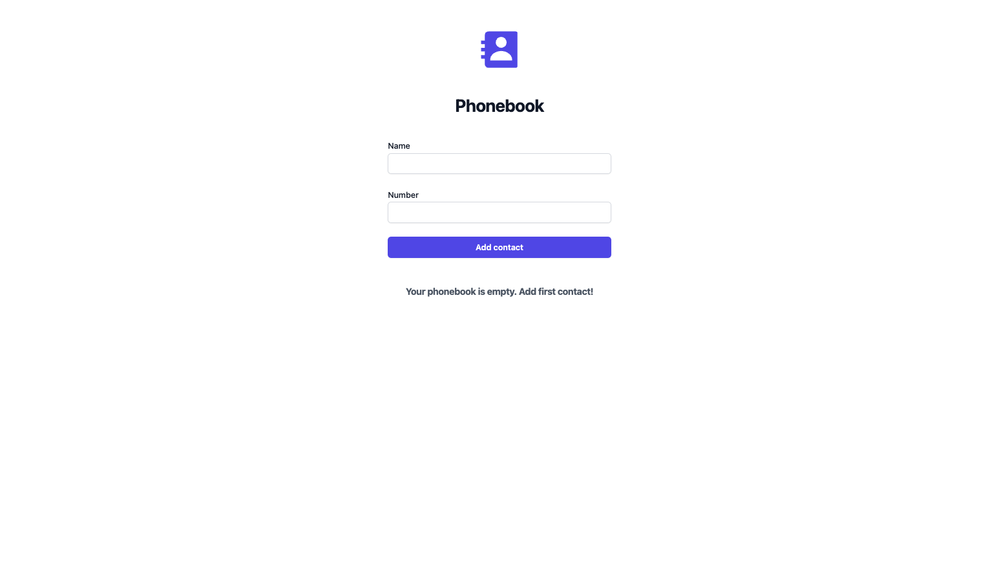

# Критерії приймання

- Створений репозиторій `goit-react-woolf-hw-03-phonebook`
- При здачі домашньої роботи є посилання: на вихідні файли та робочу сторінку
  проектів на `GitHub Pages`.
- У стані компонентів зберігається мінімально необхідний набір даних, решта
  обчислюється
- Під час запуску коду завдання в консолі відсутні помилки та попередження.
- Для кожного компонента є окрема папка з файлом React-компонента та файлом
  стилів
- Все, що компонент очікує у вигляді пропсів, передається йому під час виклику.
- Імена компонентів зрозумілі та описові
- JS-код чистий і зрозумілий, використовується `Prettier`.
- Стилізація виконана `CSS-модулями` або `Styled Components` чи `Tailwind CSS`
  🤭.

## Книга контактів

Візьми своє рішення завдання з попередньої домашньої роботи і додай зберігання
контактів телефонної книги в `localStorage`. Використовуй методи життєвого
циклу.

- Під час додавання та видалення контакту контакти зберігаються у локальне
  сховище.
- Під час завантаження застосунку контакти, якщо такі є, зчитуються з локального
  сховища і записуються у стан.

### Фінальний результат

